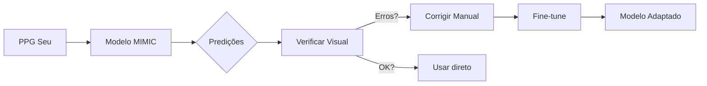

# 🏷️ Guia de Fine-Tuning e Anotação Manual

Este documento explica como refinar o modelo de detecção de picos PPG usando seus próprios dados, mesmo sem ter um ECG de referência.

---

## 1. Por que Fine-Tuning?

O modelo treinado no MIMIC-II (pacientes de UTI, idosos) pode não funcionar perfeitamente nos seus dados (jovem, saudável, sensor diferente).

**Fine-tuning** = pegar um modelo pré-treinado e ajustar com poucos dados do seu contexto.

```
Modelo MIMIC (genérico) → + Seus dados anotados → Modelo Adaptado (específico)
```

---

## 2. O Problema: "Não tenho ECG para rotular"

No MIMIC, usamos o ECG como gabarito. Nos seus dados, você só tem PPG.

**Solução:** O modelo JÁ sabe detectar picos (aprendeu no MIMIC). Você só precisa **corrigir os erros**.

---

## 3. Fluxo de Anotação Semi-Automática

```
┌──────────────────────────────────────────────────────────────┐
│ PASSO 1: Modelo prediz nos seus dados                        │
├──────────────────────────────────────────────────────────────┤
│  Seu PPG → Modelo MIMIC → Picos preditos: [127, 254, 389]    │
└──────────────────────────────────────────────────────────────┘
                              │
                              ▼
┌──────────────────────────────────────────────────────────────┐
│ PASSO 2: Você verifica visualmente                           │
├──────────────────────────────────────────────────────────────┤
│  Olha o gráfico e identifica:                                │
│  ✓ 127 → Correto                                             │
│  ✓ 254 → Correto                                             │
│  ✗ 389 → Errado! Deveria ser 395                             │
│  ✗ Faltou o pico em 520                                      │
└──────────────────────────────────────────────────────────────┘
                              │
                              ▼
┌──────────────────────────────────────────────────────────────┐
│ PASSO 3: Criar ground truth corrigido                        │
├──────────────────────────────────────────────────────────────┤
│  Picos corrigidos: [127, 254, 395, 520]                      │
│  Salvar como CSV ou array numpy                              │
└──────────────────────────────────────────────────────────────┘
                              │
                              ▼
┌──────────────────────────────────────────────────────────────┐
│ PASSO 4: Fine-tuning                                         │
├──────────────────────────────────────────────────────────────┤
│  Retreinar modelo com learning rate baixo (1e-5)             │
│  Poucas épocas (5-10)                                        │
└──────────────────────────────────────────────────────────────┘
```

---

## 4. Métodos de Anotação Manual

### Método 1: Correção em CSV (Mais Simples)

1. Rodar modelo e salvar predições:
```python
predicted_peaks = model.predict(ppg)
np.savetxt('peaks_predicted.csv', predicted_peaks, delimiter=',')
```

2. Abrir CSV no Excel/LibreCalc
3. Comparar com gráfico e editar valores errados
4. Salvar como `peaks_corrected.csv`

**Prós:** Simples, não precisa de código extra
**Contras:** Trabalhoso, propenso a erros

---

### Método 2: Clique Interativo no Gráfico (Recomendado)

Widget Python onde você clica diretamente nos picos:

```python
import matplotlib.pyplot as plt

class PeakAnnotator:
    """Ferramenta para anotar picos clicando no gráfico."""
    
    def __init__(self, ppg, fs=125):
        self.ppg = ppg
        self.fs = fs
        self.peaks = []
        self.fig, self.ax = plt.subplots(figsize=(16, 4))
        
        # Plotar sinal
        t = np.arange(len(ppg)) / fs
        self.ax.plot(t, ppg, 'purple', linewidth=0.8)
        self.ax.set_xlabel('Tempo (s)')
        self.ax.set_ylabel('PPG')
        self.ax.set_title('Clique nos PICOS para marcar | Clique direito para remover último')
        self.ax.grid(True, alpha=0.3)
        
        # Conectar eventos
        self.fig.canvas.mpl_connect('button_press_event', self.on_click)
        self.markers = []
        
    def on_click(self, event):
        if event.inaxes != self.ax:
            return
            
        if event.button == 1:  # Clique esquerdo = adicionar
            x_sample = int(event.xdata * self.fs)
            self.peaks.append(x_sample)
            marker = self.ax.axvline(event.xdata, color='red', alpha=0.6, linewidth=2)
            self.markers.append(marker)
            
        elif event.button == 3:  # Clique direito = remover último
            if self.peaks:
                self.peaks.pop()
                self.markers[-1].remove()
                self.markers.pop()
                
        self.fig.canvas.draw()
        
    def get_peaks(self):
        return sorted(self.peaks)
    
    def save(self, filepath):
        np.savetxt(filepath, self.get_peaks(), fmt='%d')
        print(f"Salvos {len(self.peaks)} picos em {filepath}")

# Uso:
annotator = PeakAnnotator(seu_ppg, fs=125)
plt.show()

# Depois de anotar:
annotator.save('meus_picos_anotados.csv')
```

**Prós:** Visual, intuitivo, rápido
**Contras:** Precisa rodar em ambiente com GUI (não funciona em server)

---

### Método 3: Correção de Predição Existente (Mais Rápido)

Se o modelo já acerta ~90%, você só corrige os erros:

```python
class PeakCorrector:
    """Corrige predições existentes do modelo."""
    
    def __init__(self, ppg, predicted_peaks, fs=125):
        self.ppg = ppg
        self.peaks = list(predicted_peaks)
        self.fs = fs
        self.fig, self.ax = plt.subplots(figsize=(16, 4))
        
        t = np.arange(len(ppg)) / fs
        self.ax.plot(t, ppg, 'purple', linewidth=0.8)
        
        # Mostrar picos preditos
        self.markers = []
        for peak in self.peaks:
            marker = self.ax.axvline(peak/fs, color='green', alpha=0.5)
            self.markers.append(marker)
        
        self.ax.set_title('Verde=predito | Clique esq=adicionar | Clique dir=remover mais próximo')
        
        self.fig.canvas.mpl_connect('button_press_event', self.on_click)
        
    def on_click(self, event):
        if event.inaxes != self.ax:
            return
            
        x_sample = int(event.xdata * self.fs)
        
        if event.button == 1:  # Adicionar pico
            self.peaks.append(x_sample)
            marker = self.ax.axvline(event.xdata, color='red', alpha=0.8)
            self.markers.append(marker)
            
        elif event.button == 3:  # Remover pico mais próximo
            if self.peaks:
                closest_idx = np.argmin(np.abs(np.array(self.peaks) - x_sample))
                self.peaks.pop(closest_idx)
                self.markers[closest_idx].remove()
                self.markers.pop(closest_idx)
        
        self.fig.canvas.draw()
```

**Prós:** Muito rápido se modelo já é bom
**Contras:** Pode perder picos se não verificar tudo

---

### Método 4: Active Learning (Avançado)

O modelo indica regiões de **baixa confiança**, você prioriza anotar essas:

```python
# Modelo retorna probabilidades por sample
probs = model.predict_proba(ppg)  # Shape: (n_samples,)

# Encontrar regiões incertas
uncertain_mask = (probs > 0.3) & (probs < 0.7)
uncertain_regions = np.where(uncertain_mask)[0]

# Mostrar só essas regiões pro humano
print(f"Regiões incertas: {len(uncertain_regions)} samples para revisar")
```

**Prós:** Maximiza valor da anotação humana
**Contras:** Mais complexo de implementar

---

## 5. Quanto Anotar?

| Quantidade | Qualidade esperada | Tempo estimado |
|------------|-------------------|----------------|
| 30 segundos (~40 picos) | Teste básico | 5 min |
| 2 minutos (~150 picos) | Fine-tuning mínimo | 15 min |
| 5 minutos (~400 picos) | Bom fine-tuning | 30 min |
| 10 minutos | Excelente | 1 hora |

**Dica:** Anote sessões variadas (repouso, pós-esforço, respiração lenta).

---

## 6. Código de Fine-Tuning

Depois de anotar:

```python
def fine_tune_model(model, ppg, corrected_peaks, epochs=10, lr=1e-5):
    """
    Fine-tune o modelo com seus dados anotados.
    
    Args:
        model: Modelo pré-treinado (Performer)
        ppg: Sinal PPG normalizado
        corrected_peaks: Lista de índices dos picos corretos
        epochs: Número de épocas (poucos!)
        lr: Learning rate (baixo!)
    """
    # Criar labels a partir dos picos
    labels = np.zeros(len(ppg))
    for peak in corrected_peaks:
        for offset in range(-3, 4):  # ±3 samples
            if 0 <= peak + offset < len(labels):
                labels[peak + offset] = 1
    
    # Criar janelas
    X, y = create_windows(ppg, labels, window_size=500, stride=125)
    
    # Fine-tuning com learning rate baixo
    optimizer = torch.optim.Adam(model.parameters(), lr=lr)
    
    for epoch in range(epochs):
        model.train()
        # ... loop de treino normal ...
    
    return model
```

**Regras de ouro:**
- Learning rate **10-100x menor** que no pré-treino
- Poucas épocas (5-15) para não "esquecer" o MIMIC
- Validar em dados que você NÃO anotou

---

## 7. Resumo do Fluxo



---

> **Próximo passo:** Rodar o modelo no seu PPG do mindinho e ver quantos erros ele comete. Se <10%, talvez nem precise de fine-tuning!
