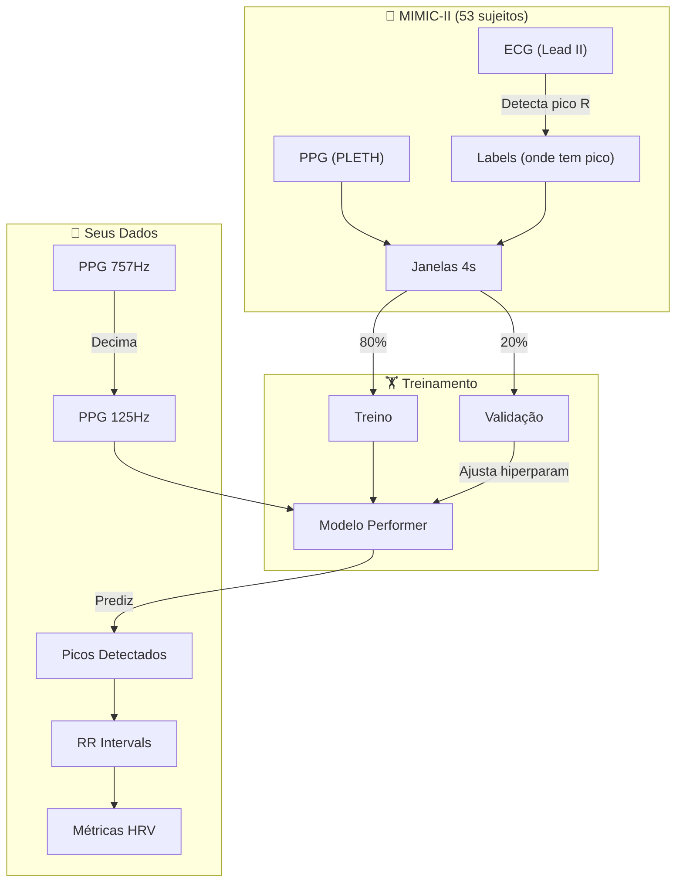

# 🧠 Guia de Machine Learning para o TCC (PPG/HRV)

Este documento explica os conceitos fundamentais de ML aplicados ao seu projeto de detecção de picos em sinais PPG usando Transformer (Performer).

---

## 1. O Problema: Onde está o Pico?

### O que temos:
- **PPG (Fotopletismografia):** Sinal do dedo que mostra o pulso de sangue.
- **Objetivo:** Encontrar o pico sistólico (momento de máximo fluxo) para calcular RR intervals → HRV.

### O desafio:
Algoritmos clássicos (`find_peaks`) funcionam em sinais limpos, mas falham com ruído, movimento, ou morfologia atípica. ML pode aprender padrões mais robustos.

---

## 2. Supervised Learning: X, y, e o Gabarito

### Conceito Central
```
Entrada (X) ──► MODELO ──► Saída Prevista (ŷ)
                              │
                 Comparar com Gabarito (y) → Erro → Ajustar modelo
```

### No seu projeto:

| Símbolo | O que é | Exemplo concreto |
|---------|---------|------------------|
| **X** | Janela de PPG | `[0.23, 0.31, 0.45, ...]` (500 amostras = 4s) |
| **y** | Rótulo (onde tem pico) | `[0, 0, 1, 1, 0, 0, ...]` (1 = pico) |
| **ŷ** | Predição do modelo | `[0.1, 0.2, 0.9, 0.8, 0.1, ...]` (probabilidades) |

### De onde vem o gabarito (y)?
Do **ECG**! O pico R do ECG é fácil de detectar (bico agudo). Transferimos essa informação para o PPG (+200ms de atraso = Pulse Transit Time).

> **Insight:** O ECG é usado apenas para CRIAR os rótulos. Depois do treino, não precisamos mais dele.

---

## 3. Por que Separar Dados? (Train/Val/Test)

### Analogia: Prova de Escola
- **Treino:** Exercícios do livro (o aluno estuda).
- **Validação:** Simulado (professor ajusta a dificuldade da prova).
- **Teste:** Prova final (nota real, sem cola).

Se você der a prova final como exercício de treino, o aluno decora as respostas → Nota inflada, mas não aprendeu nada.

### Em ML:

| Conjunto | Tamanho típico | Pra que serve |
|----------|----------------|---------------|
| **Treino** | 70-80% | Modelo ajusta pesos |
| **Validação** | 10-15% | Você ajusta hiperparâmetros (learning rate, etc.) |
| **Teste** | 10-15% | Nota final (nunca toca até o fim) |

---

## 4. Data Leakage: O Erro Silencioso

### O que é?
Informação do conjunto de teste "vaza" para o treino, inflando artificialmente a performance.

### Exemplo no seu projeto (ERRADO):

```
Pessoa A gravou 8 minutos de PPG.
Dividimos em 100 janelas de 4 segundos.

Split aleatório (80/20):
├── Treino: 80 janelas (algumas são da Pessoa A)
└── Teste: 20 janelas (outras são da Pessoa A)

Problema: O modelo aprende o "estilo" da Pessoa A.
No teste, ele reconhece: "Já vi essa pessoa!" → Acerta fácil.
Mas essa nota não significa que vai funcionar pra você (Pessoa B).
```

### Solução: Separar por SUJEITO

```
53 Pessoas no BIDMC.

LOSO (Leave-One-Subject-Out):
├── Treino: 52 pessoas (TODAS as janelas deles)
└── Teste: 1 pessoa (TODAS as janelas dela)

O modelo NUNCA viu ninguém parecido com a pessoa de teste.
Se acertar → Realmente generalizou!
```

---

## 5. Transfer Learning: Por que funciona?

### Problema original:
Você tem poucos dados próprios (~3 sessões). Não dá pra treinar um Transformer.

### Solução:
Usar o conhecimento de um dataset gigante (MIMIC-II = 53 pessoas, ~7 horas de dados).

### Analogia: Aprender a dirigir
1. **Pré-treino (MIMIC):** Você aprende a dirigir em carros automáticos (100 horas de prática).
2. **Fine-tuning (Seus dados):** Você adapta para um carro manual (5 horas de prática).
3. **Inferência:** Você dirige o carro do seu projeto (sem instrutor).

### No código:
```python
# Pré-treino: modelo aprende PPG genérico com MIMIC
model = PPGPeakPerformer()
train(model, mimic_data, epochs=50)

# Fine-tuning: adapta ao ruído do seu ESP32
train(model, seus_dados, epochs=10, lr=1e-4)  # Learning rate menor!

# Inferência: usa no seu sinal novo
peaks = model.predict(novo_ppg)
```

---

## 6. O que o Modelo REALMENTE Aprende?

### Você pensou:
> "Ele gera um ECG sintético?"

### Realidade:
**Não.** O modelo aprende a **forma da onda PPG** que indica um pico.

```
PPG típico perto de um pico:
        __
       /  \       ← Subida íngreme, descida suave = PICO AQUI
      /    \__
     /        \_
____/

O modelo vê milhares de exemplos assim e "memoriza":
"Quando vejo esse padrão → probabilidade de pico = 0.95"
```

### Por que ECG é o gabarito?
O ECG marca o momento EXATO do batimento (pico R = despolarização ventricular). O pico do PPG ocorre ~200ms depois (tempo do sangue chegar ao dedo).

```
Tempo:     0ms      100ms     200ms     300ms
ECG:       |R|                           (batimento elétrico)
PPG:                          |P|        (sangue chega ao dedo)
                               ↑
                          PTT (Pulse Transit Time)
```

O modelo aprende: "dado o formato do PPG, o pico está aqui" – sem precisar do ECG depois.

---

## 7. Métricas: Como saber se está bom?

### Para Detecção de Picos:

| Métrica | O que mede | Fórmula |
|---------|------------|---------|
| **Precision** | Dos picos que previ, quantos eram reais? | TP / (TP + FP) |
| **Recall** | Dos picos reais, quantos eu achei? | TP / (TP + FN) |
| **F1 Score** | Média harmônica (balanceia os dois) | 2 × P × R / (P + R) |

### Exemplo:
```
Ground Truth: [0, 0, 1, 0, 0, 0, 1, 0]  (2 picos reais)
Predição:     [0, 0, 1, 1, 0, 0, 0, 0]  (previu 2 picos)

TP (True Positive) = 1 (acertou o pico na posição 3)
FP (False Positive) = 1 (errou na posição 4, não era pico)
FN (False Negative) = 1 (perdeu o pico na posição 7)

Precision = 1/2 = 50%
Recall = 1/2 = 50%
F1 = 50%
```

### Para HRV (RR Intervals):
- **MAE (Erro Médio Absoluto):** Diferença média entre RR predito e RR real (ms).
- **Correlação:** RR preditos seguem a mesma tendência que os reais?

---

## 8. Seu Pipeline Completo



---

## 9. Checklist para o TCC

- [ ] Entender o conceito de X, y, e gabarito
- [ ] Saber explicar por que usamos ECG como gabarito
- [ ] Entender Data Leakage e por que LOSO é melhor
- [ ] Saber a diferença entre Treino, Validação e Teste
- [ ] Entender Transfer Learning (MIMIC → Seus dados)
- [ ] Saber calcular Precision, Recall, F1

---

## 10. Próximos Passos Práticos

1. **Rodar o notebook** `02_performer_peak_detection.ipynb` e observar as predições.
2. **Coletar 3-5 sessões suas** com o ESP32 para fine-tuning.
3. **Validar visualmente:** O modelo está achando os picos certos no seu sinal?
4. **Calcular métricas:** Se você anotar manualmente 1 minuto de picos, pode calcular F1.

---

> **Dúvida?** Pergunte! Esse é um resumo simplificado. Cada tópico pode ser aprofundado conforme necessidade do TCC.
